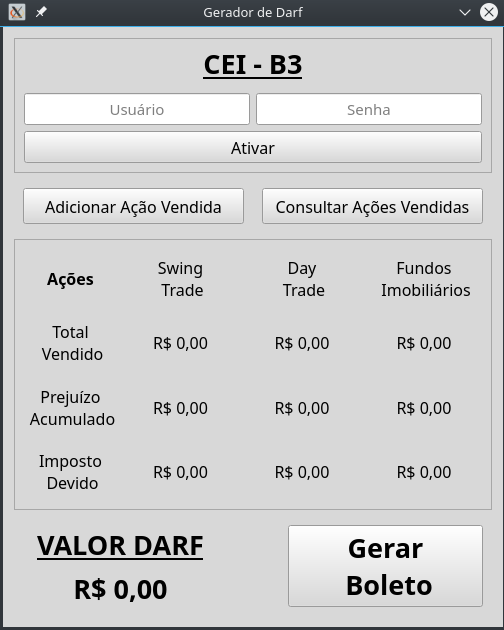

# Gerador Automático do DARF

Um software de código aberto que está em desenvolvimento utilizando a linguagem Python3 Tem por objetivo calcular automaticamente o imposto de renda de aplicações financeiras na bolsa de valores e gerar o boleto do **DARF** (Documento de Arrecadação de Receitas Federais) para pagamento.

  

## Funcionamento

O software funcionará se comunicando com o sistema **CEI - B3** para obter os dados de compra e venda de títulos e, então, calcular o imposto de renda devido. O software também permitirá adição manual de compra e venda de títulos, além de permitir a consulta dos títulos obtidos do sistema **CEI - B3** e adicionados manualmente. Os valores de imposto de renda serão exibidos em uma interface gráfica para o usuário. Caso haja imposto a ser pago, será permitido ao usuário utilizar o botão **Gerar Boleto** o qual se comunicará com o sistema da Receita Federal (SicalcWeb) para gerar o boleto a ser pago sobre os lucros obtidos nas aplicações financeiras daquele mês.

## Arquitetura do Sistema

O sistema será dividido em 4 subsistemas como mostrado abaixo:

- **1-) Comunicação com CEI - B3** : Obtenção dos dados de compra e venda de títulos do sistema **CEI - B3**.
- **2-) Cálculo do Imposto**       : Cálculo dos impostos utilizando as regras aplicáveis.
- **3-) Geração de Boleto**        : Comunicação com o sistema da receita federal (SicalcWeb) para gerar o
                                     boleto de pagamento do **DARF**.
- **4-) GUI**                      : Interface gráfica com o usuário que exibirá os dados calculados de imposto e valores totais
                                     vendidos por categoria de título financeiro. Fornecerá também botões de geração de boleto,
                                     consulta dos títulos vendidos no mês, possibilidade de adição manual de compra e venda de
                                     títulos e campos para _login_ no sistema **CEI - B3**.

## Quer contribuir?

Trata-se de um projeto de código aberto e qualquer contribuição é super bem vinda.

As tarefas estão visíveis na sessão **_Issues_** deste repositório e outras ainda estarão sendo adicionadas. Para quem deseja contribuir, basta escolher uma tarefa e realizar o **_FORK_** do projeto e então mão na massa!

Estamos abertos para tirar qualquer dúvida :).
